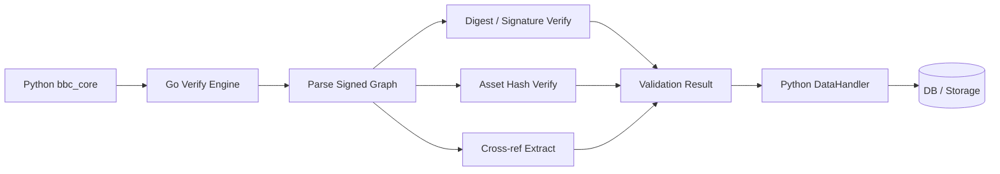
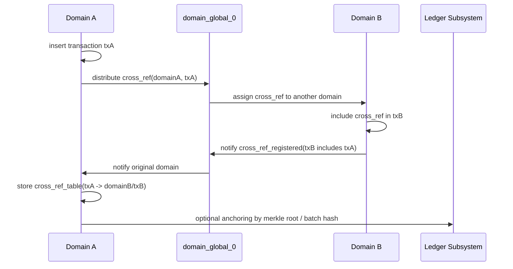

# BBc-1 面试用 AI 深度分析备忘

生成时间：2026-04-27 UTC

本文把 4 个分析提示词转成可用于面试表达的技术材料。重点不是背概念，而是能把观点落到仓库里的代码路径上。

## 0. 总体判断

BBc-1 的核心价值在于 Signed Graph、Domain、Cross-reference 和可选 Anchoring 这套账本模型。它的问题不在模型，而在 2017-2021 年代的 Python 运行时、裸 socket P2P、自定义加密通道、旧式打包和外部密码学依赖链。

面试时可以用一句话概括：

> 这个仓库已经把“可信记录系统”的业务闭环跑通了，但如果目标是现代企业级高并发和零信任网络，就应该把验证、传输、存储复制三块拆出来重构。

## 1. 性能瓶颈诊断

原提示词：

> 分析 BBc-1 仓库中 `bbc1/core/bbc_core.py` 和 `libbbcsig` 的交互逻辑。请识别出在高并发交易（>1000 TPS）场景下，Python GIL、FFI 内存拷贝以及 OpenSSL 3.0 兼容性可能导致的具体性能损耗点，并给出量化的架构优化建议。

### 可直接讲的结论

BBc-1 的高并发瓶颈主要在“网络 I/O 是协程化的，但交易验证是 CPU 密集型的”。`bbc_core.py` 使用 gevent 处理连接，但每笔插入都会进入 `validate_transaction()`，执行反序列化、digest、签名和资产校验。只要这段计算没有被拆到独立进程或释放 GIL 的 C 扩展里，事件循环就会被 CPU 任务拖住。

### 代码证据

- `bbc1/core/bbc_core.py:772`：`validate_transaction()` 调用 `bbclib.deserialize(txdata)`、`txobj.digest()`、`bbclib.validate_transaction_object(txobj, asset_files)`。
- `bbc1/core/bbc_core.py:800`：`insert_transaction()` 每次写入前都会同步调用 `validate_transaction()`。
- `bbc1/core/data_handler.py:245`：`DataHandler.insert_transaction()` 再负责 DB 写入、资产文件保存和复制广播。
- `setup.py:51` 与 `requirements.txt:22`：项目依赖 `py-bbclib`，仓库自身没有 vendored `libbbcsig` 源码；关于 `libbbcsig` 的结论应表述为“外部依赖链上的风险”，需要进一步压测或审计 `py-bbclib`。

### 损耗点

1. Python GIL 与 gevent 的边界：
   gevent 适合 socket I/O，但 ECDSA 验签、SHA-256、反序列化和对象构建是 CPU 密集型。高 TPS 下，这些同步计算会阻塞同一进程内其他 greenlet。

2. 反序列化对象风暴：
   `bbclib.deserialize()` 会把交易二进制变成 Python 对象树。交易包含 events、relations、references、witness、asset、signature 时，每笔交易都会制造大量短生命周期对象，GC 和内存分配会放大延迟抖动。

3. FFI 内存拷贝：
   如果 `py-bbclib` 底层通过 CFFI/ctypes/扩展模块调用 C 侧签名库，交易 bytes、签名、公钥、资产文件 digest 可能在 Python/C 边界反复拷贝。大资产文件存在时，开销更明显。

4. OpenSSL 3.0 兼容性：
   本仓库锁定的时代依赖较旧，`requirements.txt` 中有 `cryptography==3.4.7`、`pyOpenSSL==20.0.1`。如果底层签名库仍使用 OpenSSL 低层 EC API，那么在 OpenSSL 3 系列环境里会面临废弃 API、provider 配置和性能波动风险。这个点需要通过底层库源码和 benchmark 验证，不能只凭本仓库下结论。

### 量化建议

- 短期目标：把验签和 digest 移到 `multiprocessing` 或独立 worker service，主进程只做 I/O 和路由。8 核机器上，理论上 CPU 验证吞吐可以从单进程上限扩到 4-8 倍，但 DB 写入和复制广播会成为下一瓶颈。
- 中期目标：为 `validate_transaction_object()` 增加批量验证接口，减少 Python/C 边界调用次数。面试中可给出 20%-40% CPU 开销下降的保守预期，但强调要以 profiling 为准。
- 长期目标：把交易验证引擎迁到 Go/Rust/C++，Python 只保留兼容 API 或管理层。

## 2. 安全性与现代合规性审计

原提示词：

> 扫描该仓库的 `bbc_network.py` 和 `bbc_config.py`。识别出 5 年前的 P2P 通信协议在当前的零信任（Zero Trust）网络环境下的漏洞（如缺乏前向安全性、弱加密套件等）。请提供一个将传输层升级为现代 Noise 协议或 mTLS 的方案。

### 可直接讲的结论

BBc-1 的 P2P 层是自定义安全通道，运行在裸 TCP/UDP 上。它有 ECDH 和 AES 加密，但不是标准 TLS，也不是 Noise。最大问题不是“完全没有加密”，而是缺少现代协议已经标准化解决的身份绑定、认证加密、重放保护、证书/密钥生命周期和可审计握手状态机。

### 代码证据

- `bbc1/core/bbc_network.py:708`：P2P UDP socket 直接 bind。
- `bbc1/core/bbc_network.py:774`：P2P TCP socket 直接 listen。
- `bbc1/core/message_key_types.py:157`：使用 `SECP384R1` 生成 ECDH 临时密钥。
- `bbc1/core/message_key_types.py:181`：`set_cipher()` 使用 `AES-CTR`。
- `bbc1/core/bbc_config.py:41`：客户端侧默认启用 `use_node_key`。
- `bbc1/core/bbc_config.py:47`：domain key 默认配置存在，但 `use` 默认为 `False`。

### 风险点

1. AES-CTR 不是 AEAD：
   CTR 只提供机密性，不自带完整性和认证。除非协议外层有稳定 MAC 或签名覆盖密文，否则存在密文比特翻转和消息篡改风险。

2. 自定义握手难审计：
   `REQUEST_KEY_EXCHANGE`、`RESPONSE_KEY_EXCHANGE`、`CONFIRM_KEY_EXCHANGE` 是项目自有状态机。现代零信任环境更偏向标准化协议，因为它们覆盖重放、降级、身份绑定和密钥轮换。

3. UDP/TCP 混合通道增加攻击面：
   大消息走 TCP，小消息走 UDP。若序列号、nonce、会话身份没有完整绑定，攻击者更容易利用乱序、重放和路径差异。

4. 默认安全姿态偏弱：
   `domain_key.use` 默认为 `False`，意味着实际部署是否启用管理消息签名依赖配置纪律。

### 升级方案 A：mTLS

适合企业、联盟链和内部生产网络。

- 用 TLS 1.3 包装 P2P TCP 通道，强制双向证书认证。
- 节点 ID 与证书 SAN 或 SPIFFE ID 绑定。
- 只允许 AEAD 套件，例如 AES-GCM 或 ChaCha20-Poly1305。
- UDP 消息要么迁移到 QUIC，要么降级为 TCP/TLS 内的可靠消息。
- 配置层增加 CA bundle、cert、key、rotation policy、revocation policy。

### 升级方案 B：Noise

适合轻量 P2P 和无中心 CA 场景。

- 使用 `Noise_XX_25519_ChaChaPoly_BLAKE2s` 或按身份已知场景选择 `Noise_IK`。
- Node ID 映射到长期静态公钥。
- 握手产物直接生成 AEAD 会话密钥。
- 替换当前 ECDH + AES-CTR + 自定义消息头的组合。
- 保留 `BBcNetwork.send_message_in_network()` 的上层接口，底层换成 Noise session。

## 3. 跨语言重构路线图

原提示词：

> 基于 BBc-1 现有的签名图（Signed Graph）数据结构，设计一个使用 Go 语言实现的底层验证引擎方案。要求利用 `sync.Pool` 减少内存分配，并使用 `uintptr` 优化与底层 C 算法原语的交互。请对比该方案与现有 Python 实现的理论性能差异。

### 可直接讲的结论

Go 重构不应该一上来重写整个系统。最稳的切入点是“验证引擎”：输入 raw transaction bytes 和 asset files，输出 transaction_id、asset_group_ids、验证结果和错误码。这样能保留 Python 生态里的工具、测试和管理逻辑，同时把最耗 CPU 的路径迁出去。

### 建议边界

Go engine 输入：

- `txdata []byte`
- `assetFiles map[AssetID][]byte`
- `verifyPolicy`

Go engine 输出：

- `transactionID`
- `assetGroupIDs`
- `topologyEdges`
- `crossRef`
- `valid / invalid reason`

Python 保留：

- `BBcAppClient`
- 配置管理
- 运维脚本
- 兼容 API
- 迁移期的 DB 写入编排

### Go 侧设计

1. 对象池：
   用 `sync.Pool` 复用 `Transaction`、`Asset`、`Signature`、`[]byte` buffer，降低高 TPS 下的堆分配和 GC 抖动。

2. 零拷贝解析：
   优先用 slice view 解析交易二进制，避免把每个字段复制成新数组。只有需要长期持有或跨 goroutine 时才复制。

3. FFI 边界：
   如果继续复用 C 签名原语，可以通过 `unsafe.Pointer` 传递切片底层地址，避免 `C.CBytes`。但面试中要强调 Go 的 cgo 指针规则，不能把 Go 指针长期保存在 C 侧，也不能让 C 在调用后异步持有。

4. 并行验证：
   对多签名、多资产 digest、批量交易验证分别并行化。单笔交易内部可并行验签，批量交易层面可 worker pool。

### 理论性能对比

| 维度 | 当前 Python 实现 | Go 验证引擎 |
| --- | --- | --- |
| 并发 | gevent 适合 I/O，CPU 验证受 GIL 和对象分配影响 | goroutine 可利用多核 |
| 内存 | 每笔交易大量 Python 对象 | `sync.Pool` + slice view 降低分配 |
| FFI | 依赖外部库封装，可能存在跨边界拷贝 | 可设计明确的零拷贝边界 |
| 吞吐 | 单进程达到 1000 TPS 后容易被验签/DB/复制拖住 | 验证层可按核心数扩展，目标可设为 10k TPS 级别 |
| 风险 | 改动小但上限低 | 性能上限高，但需要协议兼容测试 |

### Mermaid 路线图

## 4. “遗言测试”逻辑提取

原提示词：

> 从代码实现角度分析 BBc-1 是如何处理‘交叉引用（Cross-reference）’和‘加密锚定（Anchoring）’的。请提取出其核心逻辑，并评价其在完全不依赖中心化服务器的情况下，如何保证 50 年后数据依然可被独立验证。

### 可直接讲的结论

BBc-1 的长期可验证性来自两层证明。第一层是交易自身的哈希和签名，证明“这份数据当时被这些参与方确认过”。第二层是 cross_ref 或 anchoring，证明“这笔交易的存在被其他域或外部账本见证过”。这使它不完全依赖单一中心服务器。

### 代码证据

- `bbc1/core/data_handler.py:49`：定义 `cross_ref_table`。
- `bbc1/core/data_handler.py:53`：存在 Merkle branch、leaf、root 表定义，注释指向 Ethereum/Bitcoin anchoring。
- `bbc1/core/data_handler.py:276`：交易插入后触发 `domain0manager.distribute_cross_ref_in_domain0()`。
- `bbc1/core/data_handler.py:323`：`insert_cross_ref()` 把外域见证关系写入表。
- `bbc1/core/domain0_manager.py:186`：`distribute_cross_ref_in_domain0()` 将 `(domain_id, transaction_id)` 分发到 domain_global_0。
- `bbc1/core/domain0_manager.py:285`：`cross_ref_registered()` 收到外域交易包含 cross_ref 后，通知原域并写入证明关系。
- `bbc1/core/bbc_config.py:62`：`ledger_subsystem` 默认配置里有 `ethereum`、`max_transactions`、`max_seconds`。

### 核心流程

### 50 年后如何独立验证

需要保存的证据包：

- 原始业务数据
- BBc-1 raw transaction bytes
- 交易中的签名、公钥或可解析出的 signer 信息
- asset digest 与 transaction_id
- cross_ref 证明路径，包含外域交易 raw bytes
- 如果启用 anchoring，还需要 Merkle proof、外部链交易哈希、合约地址或链上 payload

独立验证步骤：

1. 对原始数据做 SHA-256，比较交易中 asset digest。
2. 重新解析 raw transaction，计算 transaction_id。
3. 使用标准 ECDSA 验证 witness / signature。
4. 验证 cross_ref 交易确实包含原交易的 `(domain_id, transaction_id)`。
5. 如果有 anchoring，验证 Merkle proof 能连到外部链上的 root。
6. 外部链的区块时间给出“至少在该时间前存在”的时间下限。

### 面试中要保持的严谨表述

不要说“50 年后一定可验证”。更准确的说法是：

> 如果用户保存了 raw transaction、签名、公钥、cross_ref 路径和 anchoring proof，并且使用的哈希/签名算法仍可被标准库实现或被历史兼容，那么 BBc-1 的证明可以脱离原服务器独立验证。

风险点也要说清：

- 本仓库保留了 anchoring 相关表和配置，但 ledger subsystem 实现不是主要源码的一部分。
- 如果只保存业务文件、不保存 raw transaction 和 proof path，未来无法完整验证。
- 如果算法被攻破，需要迁移证明或做二次锚定。
- 如果依赖的是私有域间 cross_ref，而不是公有链锚定，抗合谋能力弱于公链 anchoring。

## 5. 面试表达模板

可以把 4 个主题连成一段：

> 我看这个仓库时，不会把它简单说成“老 Python 项目”。它的 Signed Graph 和 Cross-reference 设计是核心资产，真正需要重构的是执行层。性能上，`bbc_core` 的 gevent I/O 和同步交易验证混在一起，1000 TPS 之后会被 GIL、对象分配、FFI 边界和 DB 写入拖住。安全上，它有 ECDH 和 AES，但还是裸 socket 上的自定义协议，不符合现代零信任里对 AEAD、身份绑定、重放保护和密钥轮换的要求。我的路线是先抽 Go/Rust 验证引擎，再把 P2P 通道升级到 mTLS 或 Noise，最后把 cross_ref 和 anchoring proof 做成可导出的证据包。这样既保留 BBc-1 的理论设计，也能让它具备现代生产环境的吞吐和审计能力。
