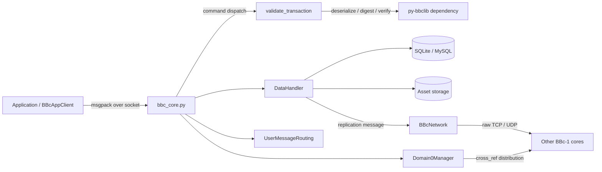
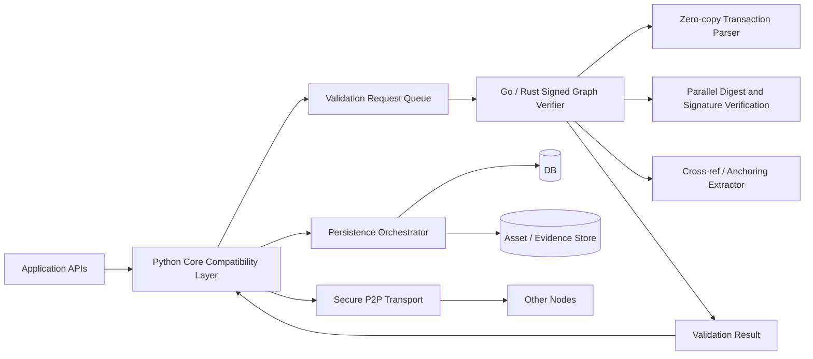
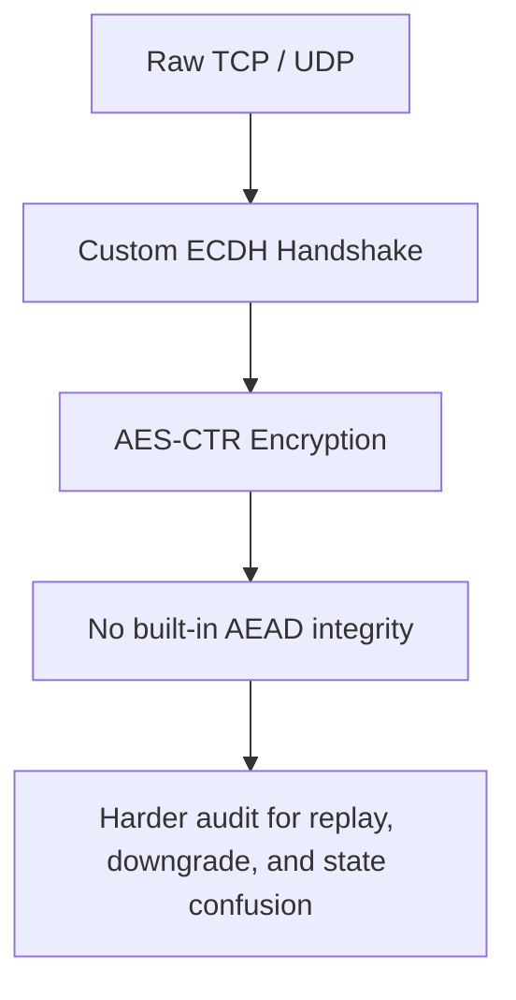
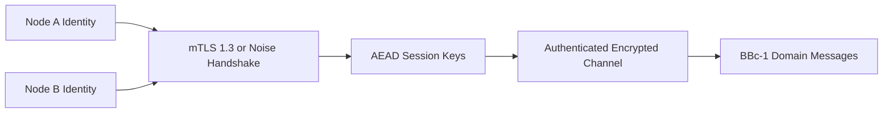
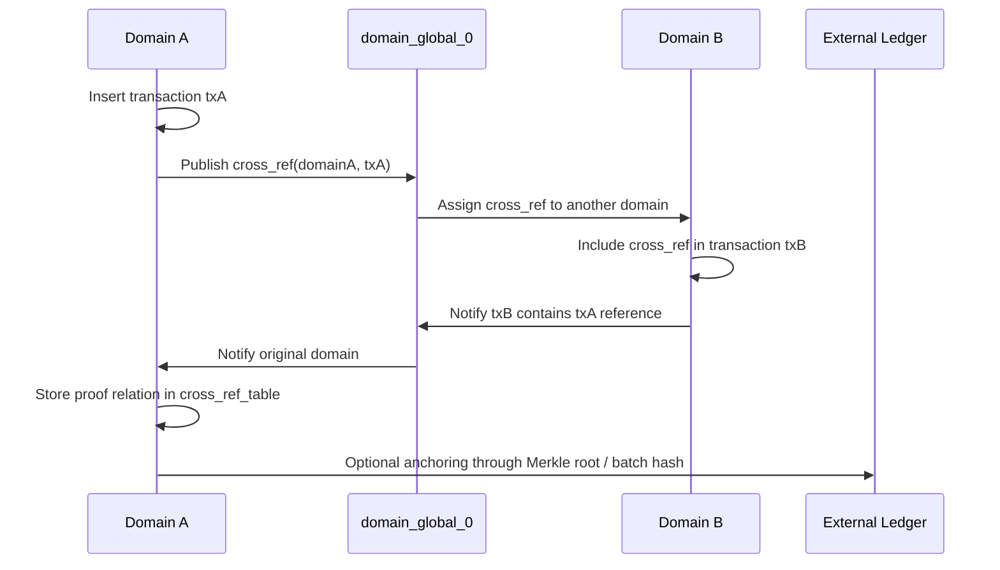
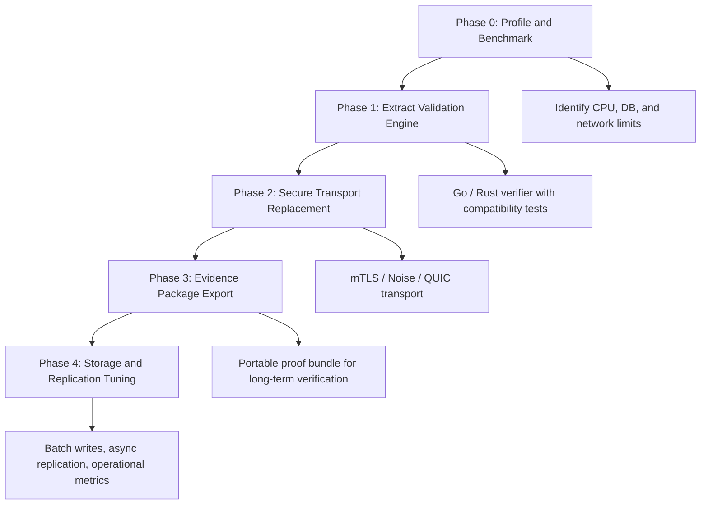

# BBc-1 Interview Brief: Architecture Risks and Modernization Plan

Generated: 2026-04-27 UTC

This document is designed for interview discussion and screen sharing. It explains what BBc-1 already gets right, where the current implementation will struggle in a modern production environment, and how to improve it without losing the core Signed Graph design.

## 1. Executive Positioning

BBc-1 is not just an old Python codebase. Its core asset is the data model: Signed Graph transactions, domain isolation, cross-reference between domains, and optional anchoring to an external ledger. The modernization work should focus on the execution layer: transaction verification, secure transport, replication, and evidence export.

Interview one-liner:

> BBc-1 has a strong trust model, but the current Python/gevent runtime, custom P2P security, and legacy dependency chain limit its throughput and compliance posture. I would keep the Signed Graph model and replace the execution hot path around it.

## 2. Current Architecture

The current system combines application APIs, core command dispatch, P2P networking, validation, persistence, and replication inside the Python runtime.

Key repository evidence:

- `bbc1/core/bbc_core.py:772`: `validate_transaction()` calls `bbclib.deserialize()`, `txobj.digest()`, and `bbclib.validate_transaction_object()`.
- `bbc1/core/bbc_core.py:800`: `insert_transaction()` synchronously validates every incoming transaction before persistence.
- `bbc1/core/data_handler.py:245`: `DataHandler.insert_transaction()` writes the transaction, stores assets, and triggers replication.
- `bbc1/core/bbc_network.py:708` and `bbc1/core/bbc_network.py:774`: P2P networking uses raw UDP and TCP sockets.
- `bbc1/core/message_key_types.py:157` and `bbc1/core/message_key_types.py:181`: the custom secure channel uses ECDH over `SECP384R1` and AES-CTR.

## 3. Main Bottleneck: Validation on the I/O Path

The main performance risk is that the networking layer is cooperative I/O, while transaction validation is CPU-heavy. `gevent` helps with socket concurrency, but it does not turn CPU-bound signature verification, hashing, and object construction into multi-core parallel execution.

Where the bottleneck appears:

- Transaction bytes are deserialized into Python object graphs.
- Transaction digest and asset digest are calculated synchronously.
- Signatures are verified through `py-bbclib` and its lower-level crypto dependency chain.
- Database writes and replication are triggered in the same request flow.

The `libbbcsig` point should be stated carefully. This repository depends on `py-bbclib`, but does not vendor the lower-level signing library source. Therefore, FFI copy cost and OpenSSL 3.0 compatibility should be presented as dependency-chain risks that need benchmark confirmation, not as proven facts from this repository alone.

## 4. Target Architecture

The recommended modernization is not a full rewrite at the first step. The first high-value extraction is a standalone validation engine. Python can continue to handle compatibility, application APIs, and operations while a Go or Rust engine handles CPU-bound verification.

Improvement points demonstrated by this diagram:

- Validation moves out of the Python I/O path.
- The verification engine can use true multi-core parallelism.
- Transaction parsing can be designed around slice views and object pools.
- The network layer becomes replaceable without changing the Signed Graph model.
- Evidence extraction becomes a first-class output, not an afterthought.

## 5. Go Verification Engine Design

A practical Go engine boundary:

Input:

- `txdata []byte`
- `assetFiles map[AssetID][]byte`
- `verifyPolicy`

Output:

- `transactionID`
- `assetGroupIDs`
- `topologyEdges`
- `crossRef`
- `valid`
- `invalidReason`

Design choices:

- Use `sync.Pool` for transaction, relation, asset, signature, and buffer objects.
- Parse transaction bytes with slice views where possible.
- Use worker pools for batch transaction verification.
- Verify multiple signatures and asset hashes in parallel when the transaction structure allows it.
- If reusing C crypto primitives, pass buffers through `unsafe.Pointer` carefully and obey cgo pointer lifetime rules.

Expected impact:

| Area | Current Python Path | Improved Engine Path |
| --- | --- | --- |
| CPU scaling | Limited by Python runtime and synchronous validation | Multi-core worker execution |
| Allocation | Many short-lived Python objects | Object pools and slice views |
| FFI boundary | Potential repeated Python/C crossing | Narrow, explicit crypto boundary |
| Latency | GC and GIL-sensitive tail latency | Lower p99 through controlled allocation |
| Throughput | >1000 TPS is likely to expose hot path limits | 10k TPS class becomes a realistic target after DB/network tuning |

## 6. Secure Transport Upgrade

The current P2P layer is a custom protocol over raw TCP and UDP. It has ECDH and encryption, but modern zero-trust systems generally require a standard, audited transport with authenticated encryption, identity binding, replay protection, and rotation policy.

Current risk:

Recommended transport options:

- mTLS 1.3 for enterprise and consortium deployments.
- Noise Protocol for lightweight peer-to-peer deployments without a heavy X.509 PKI.
- QUIC if UDP-like behavior is required together with modern authenticated encryption and connection semantics.

Target security model:

## 7. Cross-reference and Anchoring

BBc-1's long-term verification story is a strength. The system can produce cryptographic evidence that survives beyond the original server, as long as the raw transaction and proof path are preserved.

Core mechanism:

Repository evidence:

- `bbc1/core/data_handler.py:49`: `cross_ref_table` stores cross-domain proof relationships.
- `bbc1/core/data_handler.py:53`: Merkle-related tables exist for external anchoring.
- `bbc1/core/domain0_manager.py:186`: `distribute_cross_ref_in_domain0()` distributes `(domain_id, transaction_id)`.
- `bbc1/core/domain0_manager.py:285`: `cross_ref_registered()` confirms inclusion in another domain.
- `bbc1/core/bbc_config.py:62`: the default config includes an optional `ledger_subsystem` with `ethereum`.

Interview phrasing:

> BBc-1 separates business execution from cryptographic evidence. Even if the original server disappears, a verifier can recompute the asset hash, verify the transaction signature, recompute the transaction ID, and follow cross-reference or anchoring proofs to establish historical existence.

Important caveat:

This only works if the evidence package is preserved: raw transaction bytes, signatures, public keys or signer identity material, cross-reference path, and optional anchoring proof. Without those artifacts, a future verifier cannot reconstruct the proof.

## 8. Modernization Roadmap

Recommended sequence:

1. Benchmark the current `insert_transaction()` path with realistic transaction size, signature count, and asset files.
2. Extract validation into a Go or Rust service or extension with strict compatibility tests against current `bbclib` behavior.
3. Replace custom P2P encryption with mTLS or Noise while preserving the `BBcNetwork` message API.
4. Add evidence package export for raw transactions, cross-reference paths, and anchoring proofs.
5. Tune persistence separately with batch writes, backpressure, and async replication.

## 9. Interview Talk Track

Short version:

> I would not rewrite BBc-1 from scratch. The Signed Graph model and cross-reference idea are the valuable parts. The weak part is the execution environment: Python/gevent handles I/O, but validation is CPU-bound; the P2P security layer is custom; and long-term proof export is not yet productized. My plan is to extract a Go or Rust verifier, replace the transport with mTLS or Noise, and make cross-reference plus anchoring proofs exportable as a portable evidence bundle.

Technical version:

> The first bottleneck is in `bbc_core.insert_transaction()`: every transaction synchronously goes through deserialization, digest calculation, signature validation, DB persistence, and replication. That design is simple, but at >1000 TPS the CPU-bound validation path will interfere with gevent's I/O concurrency. I would isolate validation behind a typed boundary, implement a pooled and parallel verifier, and keep Python as the compatibility layer. In parallel, I would replace the current ECDH plus AES-CTR custom channel with a standard AEAD-based transport. This preserves BBc-1's trust model while making it suitable for modern production environments.
