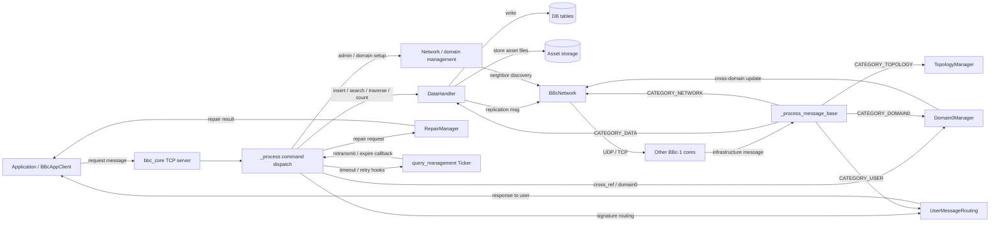

# BBc-1 项目基本结构扫描

扫描时间：2026-04-27 UTC

## 1. 项目定位

BBc-1 是一个 Python 实现的 Beyond Blockchain One 参考实现。仓库以 `bbc1` 包为核心，围绕核心节点、应用接口、网络通信、数据存储、管理工具和示例程序展开。

从代码组织上看，这个仓库可以分成三层：

- 协议与业务层：`bbc1/core/bbc_app.py`、`bbc1/core/bbc_core.py`
- 基础设施层：`bbc1/core/bbc_network.py`、`bbc1/core/data_handler.py`、`bbc1/core/topology_manager.py`
- 运维与外围层：`utils/`、`examples/`、`docker/`、`docs/`

## 2. 顶层结构概览

```text
.
├── bbc1/                 # Python 包主体
├── utils/                # 节点与域配置工具
├── examples/             # 示例应用
├── tests/                # pytest 测试
├── docker/               # Docker 相关脚本和镜像定义
├── docs/                 # 设计文档、使用说明和 API 文档
├── doczw/                # 本次生成的仓库分析文档
├── setup.py              # 打包与安装入口
├── requirements.txt      # 依赖锁定
├── README.md / README.rst # 项目说明
└── LICENSE / AUTHORS ...  # 许可证与作者信息
```

仓库当前统计到约 288 个文件，其中 `docs/`、`tests/` 和 `bbc1/` 是最大的三个内容区。

## 3. 核心代码结构

### `bbc1/`

主 Python 包，包含 22 个文件，核心都在 `bbc1/core/`。

### `bbc1/core/`

核心模块按职责拆分如下：

- `bbc_core.py`：核心节点主进程，负责从 socket 收消息、校验、分发、回复
- `bbc_app.py`：应用侧接口基类，应用和管理工具的主要入口
- `bbc_network.py`：核心节点之间的网络通信、邻居管理和跨节点消息转发
- `data_handler.py`：数据库、资产文件、事务插入和查询
- `topology_manager.py`：邻居拓扑维护
- `user_message_routing.py`：用户消息路由
- `repair_manager.py`：数据修复相关逻辑
- `domain0_manager.py`：domain 0 / cross_ref 相关处理
- `query_management.py`：定时器、重试和查询生命周期管理
- `key_exchange_manager.py`：ECDH 密钥交换管理
- `bbc_config.py`：配置文件读写和管理
- `bbc_stats.py`：统计信息管理
- `command.py`：命令行参数解析
- `bbclib.py`：对外常用库接口
- `message_key_types.py`：消息键类型定义、序列化和 TLV 辅助
- `bbc_error.py`：错误定义
- `compat/`：兼容层实现

### 包入口

- `bbc1/__init__.py`
- `bbc1/core/__init__.py`

### 打包方式

仓库使用 `setup.py` 作为安装入口，没有看到 `pyproject.toml`。`setup.py` 中声明了：

- 包名：`bbc1`
- 版本：`1.5.1`
- 主要脚本：`bbc1/core/bbc_core.py` 以及 `utils/`、`examples/file_proof/` 下的一组命令行工具

### 代码入口关系

更接近运行时的入口链路可以理解为：

1. `bbc_app.py` 负责构造请求消息并通过 socket 发往核心
2. `bbc_core.py` 监听客户端连接，接收消息后做参数检查和权限校验
3. `bbc_network.py` 负责核心节点之间的网络消息、节点发现和转发
4. `data_handler.py` 负责事务和资产的落库、搜索和复制
5. `query_management.py` 提供超时与重试的调度能力

## 4. 数据流总览

从“数据进入 -> 处理 -> 输出”的角度，这个仓库的主链路可以概括为：

- 进入：
  - 应用调用 `BBcAppClient` 方法生成消息
  - 消息经 socket 发送到 `bbc_core`
  - 核心节点间消息经 `BBcNetwork` 收发
- 处理：
  - `bbc_core._process()` 做命令路由和权限检查
  - `bbc_network._process_message_base()` 做基础设施消息分发
  - `data_handler` 负责交易写入、查询、复制和存储
  - `topology_manager`、`domain0_manager`、`repair_manager` 分别处理拓扑、跨域和修复
  - `query_management` 管理超时、重试和回调
- 输出：
  - 响应消息通过 `UserMessageRouting` 或直接 socket 回发给客户端
  - 节点间消息通过 UDP/TCP 发往邻居节点
  - 数据持久化到数据库与本地/外部存储

### Mermaid 数据流图



### 读图说明

- 左侧是外部输入：应用、管理工具、其他核心节点
- 中间是核心分发层：`bbc_core` 和 `bbc_network`
- 下方是持久化层：数据库和资产文件存储
- 右侧是输出：回包、节点间转发、跨域更新

## 5. 详细结构分层

### `bbc1/core/bbc_app.py`

这个文件定义了应用连接核心节点的主 API。它的职责是“造消息、发消息、等回包”。

典型流程是：

1. `_make_message_structure()` 创建基础消息体
2. `insert_transaction()`、`search_transaction()`、`gather_signatures()` 等方法补充业务字段
3. `_send_msg()` 按当前是否加密选择序列化格式
4. `receiver_loop()` 持续读取核心返回的数据
5. `Callback.dispatch()` 把返回消息分派到用户定义回调

### `bbc1/core/bbc_core.py`

这个文件是核心服务端。`_handler()` 接收 socket 数据，`_process()` 做协议级分发。

从代码路径看，`bbc_core` 的关键职责包括：

- 连接管理：统计客户端、处理断开、注册和注销用户
- 协议校验：参数检查、管理员消息签名校验
- 请求分发：search / insert / traverse / gather-signature / repair 等
- 回包：通过 `UserMessageRouting` 或直接 socket 回写

### `bbc1/core/bbc_network.py`

网络层负责核心节点间的消息传输。它把节点间消息按类别送到不同子系统：

- `CATEGORY_USER` -> `UserMessageRouting`
- `CATEGORY_DATA` -> `DataHandler`
- `CATEGORY_TOPOLOGY` -> `TopologyManager`
- `CATEGORY_DOMAIN0` -> `Domain0Manager`
- `CATEGORY_NETWORK` -> 网络层自身处理，例如 key exchange

### `bbc1/core/data_handler.py`

这是持久化和搜索的中心。`insert_transaction()` 是主要写入入口，`search_transaction()` 和 `search_transaction_with_condition()` 是主要读取入口。

写入链路大致为：

1. 校验交易对象
2. 写 `transaction_table`
3. 写 `asset_info_table`、`topology_table`、`cross_ref_table`
4. 保存资产文件
5. 按 replication 策略广播副本消息

读取链路大致为：

1. 按 transaction_id 或条件读库
2. 组装事务对象和资产文件
3. 校验一致性
4. 返回给 `bbc_core` 再回给客户端

### `bbc1/core/query_management.py`

这是一个轻量调度器。它不直接处理业务数据，而是维护超时、回调和重试：

- `Ticker` 维护所有定时事件
- `QueryEntry` 表示一次查询的生命周期
- 在请求未及时收到响应时，触发重试或过期回调

### `bbc1/core/topology_manager.py`

拓扑管理负责邻居关系变化、路由和转发策略。它不是主数据存储层，但会影响数据往哪里走。

### `bbc1/core/domain0_manager.py`

用于 domain 0 和 cross_ref 的跨域协调。它在交易写入后可触发跨域同步逻辑。

### `bbc1/core/repair_manager.py`

处理损坏交易或资产的恢复请求。它通常在读写链路之外作为纠错通道存在。

## 6. 工具脚本

### `utils/`

包含 8 个脚本，主要用于核心节点和域配置管理：

- `bbc_domain_config.py`
- `bbc_domain_update.py`
- `bbc_info.py`
- `bbc_ping.py`
- `domain_key_setup.py`
- `id_create.py`
- `db_migration_tool.py`
- `README.md`

这部分更像运维和管理工具，而不是业务示例。

## 7. 示例程序

### `examples/`

包含 11 个文件，分为两类：

- `examples/file_proof/`
  - `file_proof.py`
  - `README.md`
- `examples/starter/`
  - `starter.sh`
  - `requirements.txt`
  - `README.md`
  - `scripts/` 下的若干演示脚本

示例覆盖文件证明、交易注册、交易查询、用户密钥生成等典型交互流程。

## 8. 测试结构

### `tests/`

当前约 42 个文件，整体按功能分散命名，覆盖面主要集中在：

- `bbc_app` 相关流程
- `bbc_core` 与 `bbc_network`
- 配置与统计
- 数据处理
- 消息序列化
- 多客户端 / 多核心节点场景
- 兼容性测试放在 `tests/compat/`

`tests/pytest.ini` 已配置为 `--capture=no`，并定义了 `register` 和 `unregister` 标记。

## 9. 文档结构

### `docs/`

文档区内容最丰富，主要分为：

- 设计与分析类 PDF
- 日文使用说明与教程 Markdown
- API 文档源文件 `docs/api/*.rst`
- API 构建产物 `docs/api/_build/`
- 图片资源 `docs/images/`

其中 `docs/api/_build/` 是生成物，属于构建输出，不是手写源码区。

## 10. 部署与构建相关

- `docker/`：容器化部署相关脚本和 Dockerfile
- `prepare.py` / `prepare-apidoc.sh`：构建准备脚本
- `requirements.txt`：依赖版本固定
- `MANIFEST.in`：打包清单
- `renovate.json`：依赖自动更新配置

## 11. 快速结论

这个仓库的结构比较清晰，基本可以概括为：

1. `bbc1/core/` 是核心实现。
2. `utils/` 是管理和运维工具。
3. `examples/` 是使用样例。
4. `tests/` 提供较完整的回归测试。
5. `docs/` 是设计、使用和 API 文档中心。

如果后续要继续细化，下一步可以把 `bbc1/core/` 再拆成“网络层、交易层、存储层、管理层”四张更细的结构图。
